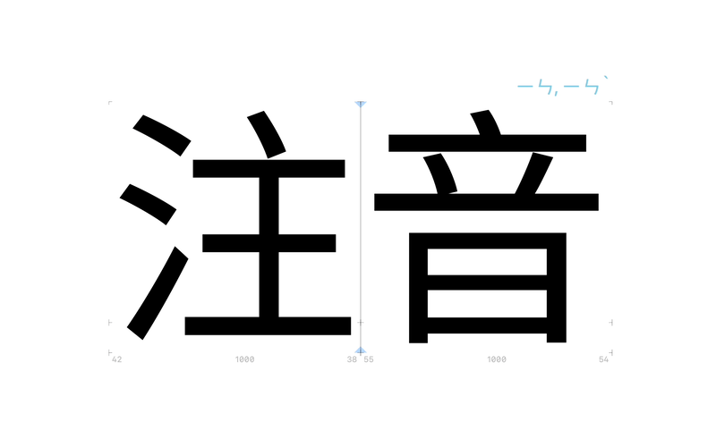

# ShowHanPhonetics

  <a href="#showhanphonetics">English</a> |
  <a href="#showhanphonetics-繁體中文">繁體中文</a>

---

A [Glyphs 3](https://glyphsapp.com/) Reporter plugin that displays Han character phonetic annotations in real time. Supports 8 display modes across multiple languages — Zhuyin (Bopomofo), Pinyin, Cantonese, Japanese, Korean, and Vietnamese — covering 122,967 characters.

## Display Modes

| Mode | Data Source | Example (一) | Coverage |
|------|------------|-------------|----------|
| Zhuyin (Bopomofo) | CNS11643 | ㄧ,ㄧˊ,ㄧˋ | 96,837 |
| Hanyu Pinyin | CNS11643 | yī,yí,yì | 96,837 |
| Wade-Giles | CNS11643 | i,i2,i4 | 96,837 |
| Mandarin Pinyin | Unicode Unihan | yī | 44,348 |
| Cantonese Jyutping | Unicode Unihan | jat1 | 27,244 |
| Japanese | Unicode Unihan | ICHI ITSU hitotsu | 19,000+ |
| Korean | Unicode Unihan | IL | 27,352 |
| Vietnamese | Unicode Unihan | nhất | 14,896 |

CNS11643 provides full polyphone annotations; Unicode Unihan covers cross-language pronunciations.

## Installation

### Plugin Manager (Recommended)

1. Open "Window > Plugin Manager" in Glyphs
2. Search for **ShowHanPhonetics** and install
3. Restart Glyphs

### Build from Source

See the build instructions on the [`source` branch](../../tree/source).

## Usage

- Toggle via "View > Han Phonetics"
- Right-click on characters to switch display modes
- Automatically hides when zoom is below 20%

UI available in 5 languages: English, Traditional Chinese, Simplified Chinese, Japanese, Korean

## Requirements

- macOS 15 (Sequoia) or later
- Glyphs 3

## License

Copyright 2025 TzuYuan Yin

Licensed under the [Apache License 2.0](http://www.apache.org/licenses/LICENSE-2.0).

### Third-Party Data Sources

- **CNS11643** (Ministry of Digital Affairs, Taiwan) — released under the [Government Open Data License](https://data.gov.tw/license)
- **Unicode Unihan Database** (Unicode Consortium) — released under the [Unicode License](https://www.unicode.org/license.txt)

---

# ShowHanPhonetics (繁體中文)

[Glyphs 3](https://glyphsapp.com/) Reporter 外掛，在字形編輯視窗中即時顯示漢字的多語言發音標注。支援注音、拼音、粵語、日語、韓語、越南語共 8 種模式，覆蓋 122,967 個字符。

## 顯示模式

| 模式 | 資料來源 | 範例（一） | 字符覆蓋 |
|------|----------|-----------|----------|
| 注音符號 | CNS11643 全字庫 | ㄧ,ㄧˊ,ㄧˋ | 96,837 |
| 漢語拼音 | CNS11643 全字庫 | yī,yí,yì | 96,837 |
| 威妥瑪拼音 | CNS11643 全字庫 | i,i2,i4 | 96,837 |
| 漢語拼音 | Unicode Unihan | yī | 44,348 |
| 粵語拼音 | Unicode Unihan | jat1 | 27,244 |
| 日本語 | Unicode Unihan | ICHI ITSU hitotsu | 19,000+ |
| 韓語 | Unicode Unihan | IL | 27,352 |
| 越南語 | Unicode Unihan | nhất | 14,896 |

CNS11643 來源提供完整的多音字標注；Unicode Unihan 來源涵蓋跨語言發音。

## 安裝方式

### Plugin Manager（推薦）

1. 在 Glyphs 中開啟「視窗 > 外掛程式管理員」
2. 搜尋 **ShowHanPhonetics**，一鍵安裝
3. 重新啟動 Glyphs

### 從原始碼編譯

請參考 [`source` 分支](../../tree/source)的編譯指引。

## 使用方式

- 「顯示 > 漢字發音」開啟/關閉
- 在字符上按右鍵選擇不同的顯示模式
- 縮放比例低於 20% 時自動隱藏

介面支援 5 種語言：繁體中文、簡體中文、英文、日文、韓文

## 系統需求

- macOS 15 (Sequoia) 或更新版本
- Glyphs 3

## 授權

Copyright 2025 TzuYuan Yin

本軟體依據 [Apache License 2.0](http://www.apache.org/licenses/LICENSE-2.0) 授權。

### 第三方資料來源

- **CNS11643 全字庫**（數位發展部）— 依據[政府資料開放授權條款](https://data.gov.tw/license)釋出
- **Unicode Unihan Database**（Unicode Consortium）— 依據 [Unicode License](https://www.unicode.org/license.txt) 釋出

---

**Author / 作者**: [TzuYuan Yin](https://erikyin.net) · [GitHub](https://github.com/yintzuyuan)
